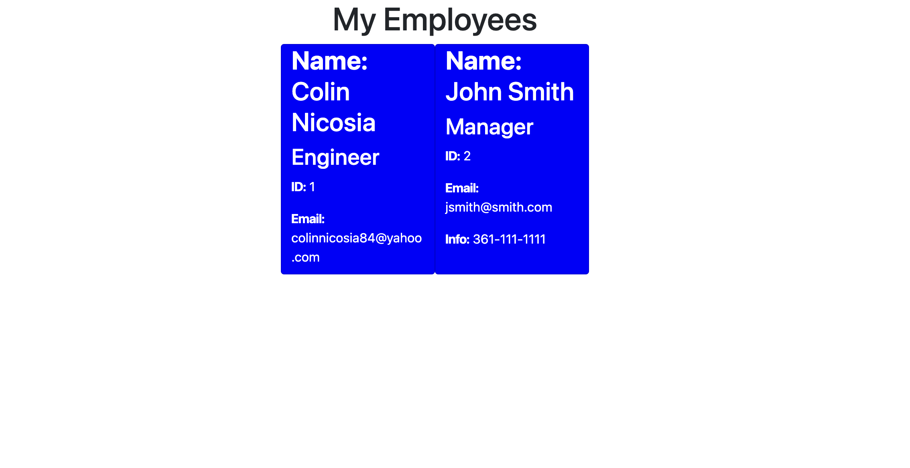

# My-Team

## Description

This application will let you create a list of emplyees with prompts from the command line. it will also generate an html page for veiwing.
## Installation

Install my-project with npm i

```bash
  npm i

```
    
## Usage/Examples

```javascript
  node index.js
```
Then follow prompts on terminal


## Screenshots




## License

[MIT](https://choosealicense.com/licenses/mit/)

